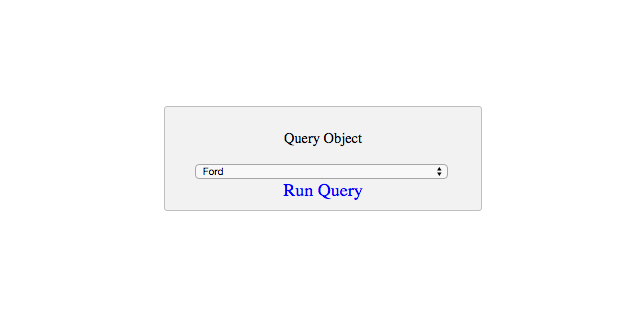

# starterTemplate-Query-Object-API
a starter template for running object queries using the Stamplay Rest API

**CLONING: When cloning this repo, you must initialize your app to make it work.**

 1) **Initialize the front-end of your app with Stamplay**
 <br>
- Go to your command line and enter **stamplay init**
- When prompted, enter your **appID** & **API Key**

3) **Establish query search**
- Go to your Stamplay editor and go to the **Data** section. Then go to **Objects**
- Establish which object(s) in the collection your going to query by looking at it's **attribute**. You will search using one of these attributes.

4) **Query Object**
```
function queryObject(){
 	var cars = document.getElementById("cars");
 	var selectedCar = cars.options[cars.selectedIndex].value;

 	var data = null;

	var xhr = new XMLHttpRequest();
	xhr.withCredentials = true;

	xhr.addEventListener("readystatechange", function () {
  		if (this.readyState === this.DONE) {
    		console.log(this.responseText);
  		}
	});

	xhr.open("GET", "https://[yourAppId].stamplayapp.com/api/cobject/v1/cobjectId/find"/selectedCar);
	xhr.setRequestHeader("accept", "application/json");
	xhr.setRequestHeader("content-type", "application/json");
	xhr.send(data);
}
```


